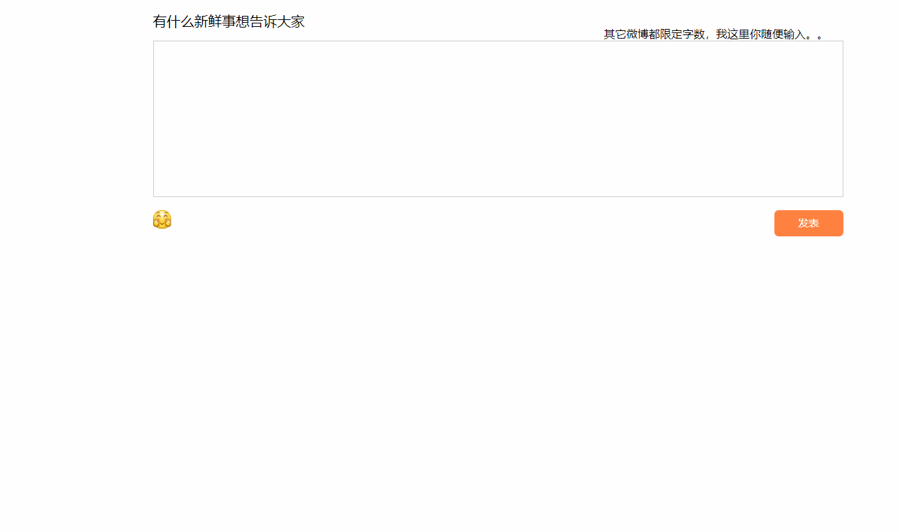

# 仿微博

    所用技术知识点：
    整个项目使用js原生
    1.ES6箭头函数
    2.let关键字使用
    3.querySelector querySelectorAll 使用
    4.原生js事件冒泡使用
    5.原生js事件委托使用
    6.数组的unshift splice使用
    7.localStorage本地存储存取
    8.JSON.stringify() JSON.parse()
    9.html5 contenteditable 属性使用
```angular2
项目简介：实现类似QQ空间微博的发送功能，具有表情选择，文字推送的功能，发出信息能保存，并且能够删除。
效果如下：
```

```angular2
js代码如下：
```
```angular2
   window.onload = function () {
        var Ms_Mu = {
            /**
             * 在控制台打印乘法表
             */
            console_Multiplication_table: () => {
                let str = "";
                for (let i = 1; i < 10; i++) {
                    for(let j = 1; j <= i; j++){
                        if(j === 3 && i <= 4){
                            str += " " + j + "X" + i + "=" + j*i + "  ";
                        }else {
                            str += j + "X" + i + "=" + j*i + "  ";
                        }
                    }
                    str += "\n";
                }
                console.info(str);
            },
            /**
             * 在页面输出乘法表
             */
            document_Multiplication_table:  () => {
                for(let i =1; i < 10; i++) {
                    document.write("<br/>");
                    for(let j = 1;j <= i; j++) {
                        if(j === 3 && i <= 4) {
                            document.write("&nbsp;&nbsp;" + j + "X" + i + "=" + j*i + "&nbsp;&nbsp;&nbsp;&nbsp;&nbsp;&nbsp&nbsp;");
                        }else {
                            document.write(j + "X" + i + "=" + j*i + "&nbsp;&nbsp;&nbsp;&nbsp;&nbsp;&nbsp;&nbsp;");
                        }
                    }
                }
            },
            /**
             * 在页面用表格的形式输出乘法表
             */
            document_Table_Multiplication_table: () => {
                var bg = "<table>";
                for(let i = 1;i <= 9;i ++){
                    bg += "<tr>";
                    for(let j = 1;j <= i;j ++){
                        bg += "<td>" + i + "*" + j + "=" + i * j + "</td>";
                    }
                    bg += "</td>";
                }
                bg += "</table>";
                document.write(bg);
            },
            /**
             * 获取当前时间
             * @param element
             */
            getLocalTime: (element) => {
                let data = new Date(),
                    year = data.getFullYear(),
                    month = data.getMonth() + 1,
                    day = data.getDate(),
                    hours = data.getHours(),
                    minutes = data.getMinutes(),
                    second = data.getSeconds(),
                    time_text = year + "-" + month + "-" + day  + "   " + hours + ":" + minutes + ":" + second;
                if(element){
                    element.innerText = time_text;
                }else {
                    return time_text;
                }
            },
            /**
             * 数组去重
             * @param array
             */
            uniq: (array) => {
                let temp = [];
                for(let i = 0;i<array.length;i++){
                    if(temp.indexOf(array[i] === -1)) {
                        temp.push(array[i])
                    }
                }
                return temp;
            },
            /**
             * 距离某天的时间
             * @param year
             * @param month
             * @param day
             * @param hour
             * @param minutes
             * @param second
             * @returns {{_day: number, _hour: number, _minutes: number, _second: number}}
             */
            countdown: (year,month,day,hour,minutes,second) => {
                //给定时间的时间蹉
                let dateToUnix = new Date(year,month,day,hour,minutes,second).getTime()/1000,
                    nowDateToUnix = Math.floor(new Date().getTime()/1000),
                    date = dateToUnix - nowDateToUnix,
                    d = Math.floor(date/(60*60*24)),
                    h = Math.floor(date%(60*60*24)/(60*60)),
                    m = Math.floor(date%(60*60*24)%(60*60)/60),
                    s = Math.floor(date%(60*60*24)%(60*60)%60);
                return {
                    _day: d,
                    _hour: h,
                    _minutes: m,
                    _second: s
                }
            },
            /**
             * 发表内容函数
             * @param time
             * @param html
             * @returns {string}
             */
            msBoxHtml: (time,html) => {
                let _html = '   <div class="msgBox">\n' +
                    '            <div class="headUrl">\n' +
                    '                \n' +
                    '                <div>\n' +
                    '                    <span class="title">木林森里没有木</span>\n' +
                    '                    <span class="time">'+ time +'</span>\n' +
                    '                </div>\n' +
                    '                <a class="del">删除</a>\n' +
                    '            </div>\n' +
                    '            <div class="msgTxt">' + html +
                    '            </div>\n' +
                    '        </div>';
                return _html;
            }
        };
        var btn = document.querySelector("#add_btn");
        btn.onclick = () => {
            let num1 = document.querySelector("#add_num1").value,
                num2 = document.querySelector("#add_num2").value,
                num3 = document.querySelector("#add_results");
            if(num1 !== "" && num2 !== "") {
                num3.value = Number(num1) + Number(num2)
            }else {
                alert("请输入数字");
            }
        };
        var time_box = document.querySelector("#time");
        Ms_Mu.getLocalTime(time_box);
        setInterval(() => {
            Ms_Mu.getLocalTime(time_box);
            let time_coun = Ms_Mu.countdown(2019,08 ,06 ,09 ,00 ,00);
            document.querySelector("#countdown").innerText = "距离毕业时间2019年08月06日09:00:00还有  " +  time_coun._day + "天" + time_coun._hour + "小时" + time_coun._minutes + "分" + time_coun._second + "秒";
        },1000);
        var submit = document.querySelector(".submit"),
            gif_enter = document.querySelector(".gif_enter"),
            textarea = document.querySelector("#textarea"),
            face = document.querySelector(".face"),
            msgCon = document.querySelector(".msgCon"),
            msgBoxList = JSON.parse(window.localStorage.getItem("msStore")) || [];
        /**
         * 调用浏览器存储渲染留言
         */
        if(msgBoxList.length){
            let _html = '';
            msgBoxList.forEach(item  => {
                _html += item;
            });
            msgCon.innerHTML = _html;
        }
        /**
         * 点击出现表情图或关闭表情图
         */
        gif_enter.onclick = (ev) => {
            if (face.getAttribute("class").split(" ").indexOf("none") !== -1) {
                face.setAttribute("class","face")
            }else {
                face.setAttribute("class","face none")
            }
            ev.stopPropagation();
        };
        /**
         * 点击某个表情生成在输入框
         * @param ev
         */
        face.onclick = (ev) => {
            ev.stopPropagation();
          let e = ev || window.event,
              target = e.target || e.srcElement,
              textarea_Html = textarea.innerHTML,
              src = target.getAttribute("src");
          if(src && target.title){
              textarea.innerHTML = textarea_Html + "";
              face.setAttribute("class","face none")
          }
        };
        /**
         * 点击页面关闭表情图
         */
        document.onclick = () => {
            if (face.getAttribute("class").split(" ").indexOf("none") === -1) {
                face.setAttribute("class","face none")
            }
        };
        /**
         * 点击发表生成对应的元素同时清空textarea
         */
        submit.onclick = () => {
            let nowTime = Ms_Mu.getLocalTime(),
                txtHtml = textarea.innerHTML,
                nowText = Ms_Mu.msBoxHtml(nowTime,txtHtml),
                _html = nowText + msgCon.innerHTML;
            msgCon.innerHTML = _html;
            msgBoxList.unshift(nowText);
            window.localStorage.setItem("msStore",JSON.stringify(msgBoxList));
            textarea.innerHTML = "";
        };
        msgCon.onclick = (ev) => {
            let e = ev || window.event,
                target = e.target || e.srcElement;
            if(target.getAttribute("class") === "del"){
                let _this_box = target.parentNode.parentNode;
                let index;
                for(let i =0;i<msgCon.children.length;i++){
                    if(msgCon.children[i] == _this_box) {
                        index = i;
                    }
                }
                msgCon.removeChild(_this_box);
                msgBoxList.splice(index,1);
                window.localStorage.setItem("msStore",JSON.stringify(msgBoxList));
            }
        }
    };
```

```angular2
拓展知识点：
```
[HTML5 LocalStorage 本地存储](http://www.cnblogs.com/xiaowei0705/archive/2011/04/19/2021372.html)

[js中const,var,let区别](https://www.cnblogs.com/ksl666/p/5944718.html)

[var、let、const 区别？](https://www.jianshu.com/p/4e9cd99ecbf5)

[js 中箭头函数使用总结](https://blog.csdn.net/yangxiaodong88/article/details/80460332)

[js箭头函数详细解说](https://www.cnblogs.com/hailun/p/6279029.html)

[w3cschools](https://www.w3schools.com/)


    